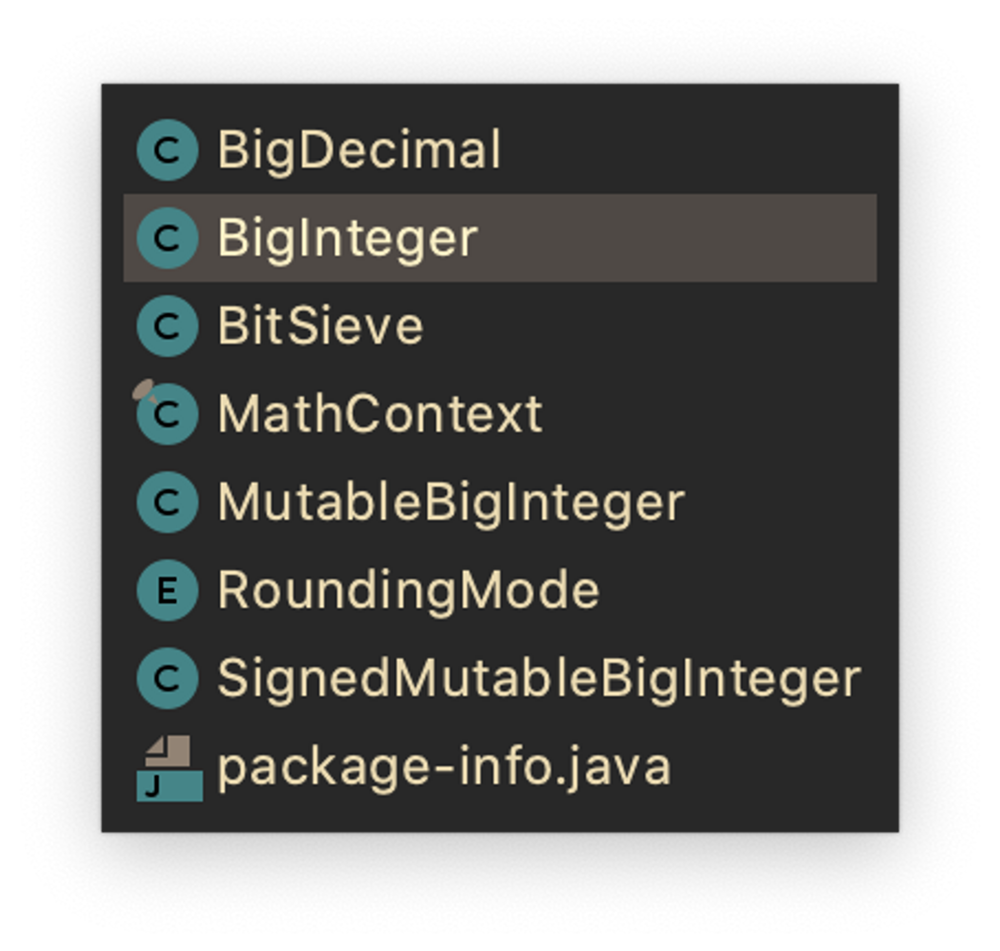

# 불변 객체를 만드는 규칙

1. 객체의 상태의 변경하는 메서드(변경자)를 제공하지 않는다.
2. 클래스를 확장할 수 없도록 한다. 상속을 막는 방법들을 적용한다
    - 클래스를 final로 선언하는 방법
    - 모든 생성자를 private 혹은 package-private로 만들고 public 정팩을 제공하는 방법
3. 모든 필드를 final로 선언한다.
4. 모든 필드를 private으로 선언한다 : 가변 필드를 직접 접근해 수정하는 방법을 막아준다.
    - 기본 타입 필드나 불변 객체를 참조하는 필드를 public final로만 선언해도 불변 객체가 되긴 하지만, 다음 릴리즈에서 내부 표현을 바꾸지 못하므로 권하는 방식이 아니다.
5. 자신 외에는 **내부의 가변 컴포넌트에 접근할 수 없도록** 한다.
    - 클래스에 가변 객체를 참조하는 필드가 있다면 클라이언트에서 그 객체의 참조를 얻을 수 없도록 해야 한다.
    - 접근자 메서드가 그 필드를 그대로 반환해서도 안된다.
        - **생성자, 접근자, readobject 메서드 모두에서 방어적 복사를 수행하라**
        - 방어적 복사
            
            내부 필드를 초기화하거나, 내부의 객체를 반환할 때, 객체의 복사본을 만들어 반환하는 것.
            
            외부에서 악의적으로 객체를 변경해도 내부에는 반영되지 않는다
            
            [https://velog.io/@miot2j/얕은복사-깊은복사-방어적-복사란](https://velog.io/@miot2j/%EC%96%95%EC%9D%80%EB%B3%B5%EC%82%AC-%EA%B9%8A%EC%9D%80%EB%B3%B5%EC%82%AC-%EB%B0%A9%EC%96%B4%EC%A0%81-%EB%B3%B5%EC%82%AC%EB%9E%80)
            

# 생각해볼만한 내용

## 불변클래스를 어디에, 어떻게 사용할 것인가?

- 불변 클래스가 관리의 용이성 등 좋다는 것은 알겠으나, 이를 어디서 어떻게 사용할 것인지는 또 다른 문제
- 기존에 직접 생성해 사용하던 클래스 중 어떤 클래스를 불변 클래스로 리팩토링 할 수 있을까?
    - 엔티티? DTO? 값 객체?
        - JPA 에서 정적메서드를 활용하는 것의 어려움
    - 엔티티를 불변클래스로 변경하는 것
        - 더티 체킹이 불가능해지지 않을까?
        - 1차 캐시에서 같은 @Id로 동일성 비교
        - 엔티티는 final 필드를 가질 수 없다.
        
        [final Class는 왜 JPA Entity가 될 수 없을까?](https://jithub.tistory.com/410)
        
    - 값 객체는 충분히 불변 클래스로 리팩토링 가능 ♻️
    
    [엔티티(Entity)와 값 타입(Value Type)](https://devbksheen.tistory.com/203)
    
- 객체 관점에서 보면 너무나 어색한 불변 클래스
    - 객체가 자신의 상태를 변경할 수 없다면 이것은 객체인가?

## 불변 객체끼리는 내부 데이터 공유가 가능해진다.

- 예시로 BigInteger 클래스를 살펴보자.
    - BigInteger는 절댓값을 int 배열(무한하게 숫자를 담기위해)로 사용하는데, negate 메서드 (음수로 변환)는 부호만 반대로 만든 새로운 BigInteger 객체를 반환한다.
        
        
        
        
        
    - 이때, 새로 만든 BigInteger 인스턴스가 가진 int 배열이 이전의 BigInteger가 가진 int 배열 원본을 가지게 된다.
    - 즉, 이전의 BigInteger의 int 배열을 새로 만든 BigInteger 인스턴스가 가진 int 배열이 가리키고 있는 것이다.
    - 왜 가능할까?
        - Biginteger 객체가 불변 객체이기 때문에 이전의 BigInteger 인스턴스의 값이 바뀌지 않는다는 것을 보장하고 있기 때문이다.
        - 새로 만든 BigInteger는 같은 int 배열 값을 나타내기를 원하는데, 불변 객체이기 때문에 공유가 가능하다는 것이다. **그리고 물론, 새로 만든 BigInteger도 불변 객체이기에 가능하다.**
        

## 네이밍 컨벤션: 객체의 값을 변경하지 않는다는 사실을 강조하지 않기 위해서 동사보다 전치사를 사용하라.

- add 같은 동사 대신 plus 같은 전치사를 쓰면, 해당 메서드가 객체의 값을 변경하지 않는다는 사실을 강조한다.

## 불변식

- 어떤 객체의 동작을 위해 절대 바뀌지 않아야 하는 값, 식, 상태의 일관성을 보장할 수 있는 참이 되는 조건.

### class invariant

- 클래스의 생성자에서 수립되고, public 메서드의 호출이 끝난 뒤 다음 호출이 발생하기 전까지 참인 조건 또는 검증 조건
- 클래스 내의 필드가 가질 수 있는 조건을 통과했을 경우에만 클래스가 생성된다면
    
    → 이 클래스를 호출하는 입장에서 클래스의 조건이 언제나 참이라고 클래스가 보장함을 알 수 있다.
    
    → 우리가 맨날 사용하는 validate 함수를 객체가 가지는 것또한 책임이라고 얘기했던 그 맥락 같다.
    
    [지속 가능한 소프트웨어를 위한 코딩 방법 - 네 번째 : NHN Cloud Meetup](https://meetup.toast.com/posts/217)
    
    ‘절차를 담당하는 클래스’는 불변 클래스로 만드는 것이 별로 바람직하지 않다. 하지만, 어떤 클래스를 불변 클래스로 만들 수 없는 상황이하더라도변화가능성을최대한줄여야한다. 객체가 가질 수 있는 상태가 줄어들수록 이 객체에 대해 생각해야 할 것이 줄어들고, 오류의 가능성도 줄어든다. 따라서, 생성자에서는 클래스의 불변규칙을 모두 만족시키는 ‘완전초기화객체(fully initialized object)’를생성해야 하고, 일부분만 초기화된 인스턴스를 다른 메소드에 전달하지 말아야한다.
    

https://download.oracle.com/global/kr/magazine/23winter_tech2.pdf


# 공유하고 싶은 내용

## 방어적 복사

### 참조가 불변이어도, 참조하는 대상의 불변까지 보장할 수 없다.

```java
// 가변 컴포넌트 address 를 갖는 Person 클래스
public final class Person {

	private final Address address;

	public Person(Address address) {
		this.address = address;
	}
	
	public Address getAddress() { 
		return this.address;
	}
}

// 가변 컴포넌트 Address 
public class Address {
	
	private int zipCode;
	
	public Address(int zipCode) {
		this.zipCode = zipCode;
	}
	
	// Getter, Setter
}
```

- 외부에서 `getAddress()` 를 통해 참조값을 얻고, 
Address의 `setZipCode()` 를 통해 얼마든지 내부 상태를 변경할 수 있다.
- address 에 대한 참조는 넘겨줄 수 있도록 하되, 레퍼런스의 내부 상태는 변경되지 않게 할 수 없을까? 
→  `방어적 복사`

```java
public final class Person {
	
	...

	// 방어적 복사
	public Address getAddress() { 
		Address copyOfAdress = new Address();
		copyOfAddress.setZipCode(this.address.getZipCode);
		return copyOfAddress;
	}
} 
```

- 그럼 Person 객체의 주소지(address)를 변경하고 싶을 때는?
    - `changeAddress(Address address)` 처럼 의도가 분명한 setter 성격의 메서드를 작성.
    - ‘모든 클래스를 불변으로 만들 수는 없다.(p.112)’
        - 필요하다면 상태 변경을 ‘요청’하는 메서드를 작성할 수 있다.

[방어적 복사와 Unmodifiable Collection](https://tecoble.techcourse.co.kr/post/2021-04-26-defensive-copy-vs-unmodifiable/)

## 불변 클래스의 단점

값이 다르면 반드시 독립된 객체로 만들어야 한다(값의 가짓수가 많다면 큰 비용이 든다)

## 불변 클래스의 단점을 보완하는 방법

1. **가변 동반 클래스 제공**흔하게 쓰일 다단계 연산(multistep-operation)을 예측하여 기본 기능으로 제공하는 것이다. `BigInteger` 예시로, 지수연산 같은 다단계 연산시 발생하는 불변 클래스의 문제점을 보완하기 위해 다단계 연산들을 묶음으로 제공하는 클래스를 제공하자.

    
    
    실제 `BigInteger` 클래스가 포함된 `Math` 패키지 구조를 살펴보면 위와 같이 추가적인 클래스들을 `package-private` 형태로 제공하고 있다. 이 클래스들을 **가변 동반 클래스(companion-class)** 라고 부른다.
    
2. **가변 동반 클래스 제공 + 불변 클래스를 `public` 으로 제공**만일 클라이언트들이 원하는 복잡한 연산을 예측할 수 없다면 불변 클래스를 `public`으로 제공하는 것이 최선이다.
    
    자바 플랫폼 라이브러리에서 이에 해당하는 대표적인 예가 바로 `String` 이다! `String`은 가변 동반 클래스로 `StringBuilder, StringBuffer`를 제공하고 있다.
    

[[아이템 17] 가변 동반 클래스 동작(사용) 예시 · Issue #15 · JunHyeok96/effective-java](https://github.com/JunHyeok96/effective-java/issues/15)

## 가변 동반 클래스란?

불변 클래스와 거의 동일한 기능을 가지고 있지만 가변적인 클래스를 가변 동반 클래스라고 한다. 가변 동반 클래스는 주로 불변 클래스가 비즈니스 로직 연산 등 시간 복잡도가 높은 연산시 불필요한 클래스 생성을 막기 위해 내부적으로 사용한다.

## 정리

- 클래스는 꼭 필요한 경우가 아니라면 불변이어야 한다
- 불변으로 만들 수 없는 클래스라도 변경할 수 있는 부분을 최소한으로 줄이자

# 레퍼런스
[https://velog.io/@miot2j/얕은복사-깊은복사-방어적-복사란](https://velog.io/@miot2j/%EC%96%95%EC%9D%80%EB%B3%B5%EC%82%AC-%EA%B9%8A%EC%9D%80%EB%B3%B5%EC%82%AC-%EB%B0%A9%EC%96%B4%EC%A0%81-%EB%B3%B5%EC%82%AC%EB%9E%80)

[final Class는 왜 JPA Entity가 될 수 없을까?](https://jithub.tistory.com/410)

[엔티티(Entity)와 값 타입(Value Type)](https://devbksheen.tistory.com/203)

[지속 가능한 소프트웨어를 위한 코딩 방법 - 네 번째 : NHN Cloud Meetup](https://meetup.toast.com/posts/217)

https://download.oracle.com/global/kr/magazine/23winter_tech2.pdf

[방어적 복사와 Unmodifiable Collection](https://tecoble.techcourse.co.kr/post/2021-04-26-defensive-copy-vs-unmodifiable/)

[[아이템 17] 가변 동반 클래스 동작(사용) 예시 · Issue #15 · JunHyeok96/effective-java](https://github.com/JunHyeok96/effective-java/issues/15)
