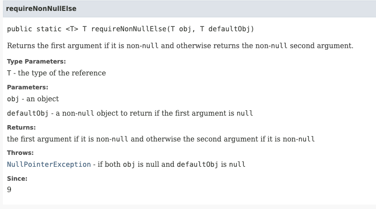

# 생각해볼만한 내용

## 오류는 가능한 한 빨리 잡아야 한다

- 메서드 몸체가 실행되기 전에 매개변수를 확인한다면 잘못된 값이 넘어왔을 때 즉각적이고 깔끔한 방식으로 예외를 던질 수 있다.

### 오류를 바로 잡지 못하면 발생하는 일

- 메서드가 수행되는 중간에 모호한 예외를 던지며 실패할 수 있다.
- 메서드가 정상적으로 수행되지만 잘못된 결과를 발생한다.
- 메서드는 문제없이 수행됐지만, 어떤 객체를 이상한 상태로 만들어놓아서 미래의 알 수 없는 시점에 메서드와는 관련 없는 오류를 낼 수 있다.
- 클라이언트까지 가서 오류가 터지면 어디서부터 시작된 오류인지 추적하기가 어려워진다.

# 스프링은 중복되는 validation을 어떻게 처리하고 있을까?

[Validation 어디까지 해봤니? : NHN Cloud Meetup](https://meetup.toast.com/posts/223)

[[Spring] @Valid와 @Validated를 이용한 유효성 검증의 동작 원리 및 사용법 예시 - (1/2)](https://mangkyu.tistory.com/174)

- `@Valid` `@Validated`

# assertion은 왜 쓸까?

- private은 개발자가 직접 통제 가능하니까 개발자들끼리의 정보 교환
- public 은 javadocs을 활용하여 컨텍스트 정보를 준다.
    - private 은 javadocs를 사용하지 않으니까 context정보를  추가적으로 전달하기 위한 용도
    - [“개발자가 참이라고 가정하는 상태를 명시하기 위해서 사용”](https://javacan.tistory.com/entry/79)

## 이미 메서드를 호출하는 곳에서 유효성검사를 다 해서 인자로 넘겨주면 되는 거 아닐까?

- 이미 호출하는 곳에서 validation 이 끝났으니까, 왜 굳이 호출된 메서드 내부에서 validation 하지?
    - 중간에 제 3자가 조작한다면?
- private 메서드에서 assert 를 사용함으로써, ‘~~하게 validate 되었습니다’ 라고 활용할 수도 있다.

## public 접근제어자 에서만 유효성 검사를 하면 될까?

```java
/**
 * Returns a BigInteger whose value is {@code (this mod m}).  This method
 * differs from {@code remainder} in that it always returns a
 * <i>non-negative</i> BigInteger.
 *
 * @param  m the modulus.
 * @return {@code this mod m}
 * @throws ArithmeticException {@code m} &le; 0
 * @see    #remainder
 */
public BigInteger mod(BigInteger m) {
    if (m.signum <= 0)
        throw new ArithmeticException("BigInteger: modulus not positive");

    BigInteger result = this.remainder(m);
    return (result.signum >= 0 ? result : result.add(m));
}
```

> “생성자 매개변수의 유효성 검사는 클래스 불변식을 어기는 객체가 만들어지지 않게 꼭 필요하다.” (p.300)
>
- 바우처 미션 중 생성하는 Amount 객체의 생성자 또한 public 메서드. 우리는 유효성 검사를 잘하고 있었다..!

### 단언문과 유효성 검사는 언제하는가

> “공개되지 않은 메서드라면 패키지 제작자인 여러분이 메서드가 호출되는 상황을 통제할 수 있다.” (p.300)
>
- 여기서 말하는 공개의 범위란?
    - 여기서 말하는 ‘public’ 이 정확히 접근제어자 public을 의미하지 않을 수도 있다.
    - 공개되지 않은 메서드 → private, package-private(default)
    - protected? 상속하면 public
    - public 과 protected
- 그렇다면 private 과 default 메서드는 는 유효한 파라미터를 전달받는 것을 보장하는가?

  > “공개되지 않은 메서드라면, 오직 유효한 값만이 메서드에 넘겨지리라는 것을 여러분이 보증할 수 있고, (assert문을 이용하여) 보증해야한다.” p.300
  >
    - 개발자가 통제하는 접근 제어자?
    - private 과 default 메서드에서는 assert 를 사용해보자

→ protected 는 공개인가 아닌가?

> ✏️ 정리
> 
> private, package-private 에서는 assert 사용하여 validation
> public 에서는 조건문을 이용한 validation

## Objects.requireNonNull()

> “반환 값은 무시하고 필요한 곳 어디서든 순수한 null 검사 목적으로 사용해도 된다.” (p.300)
>

```java
// 어디서든 순수한 null검사 목적으로 사용해도 되는 requireNonNull
public static <T> T requireNonNull(T obj) {
    if (obj == null)
        throw new NullPointerException();
    return obj;
}

// 메시지도 같이 던져보자
public static <T> T requireNonNull(T obj, String message) {
    if (obj == null)
        throw new NullPointerException(message);
    return obj;
}
```

- 미션 리뷰 중 “예외 메시지도 같이 던져보라” 라는 리뷰가 있었다.
    - `equireNonNull(T obj, String message)` 또한 이 경우에 해당되는 것 같다. 단순한 `requireNonNull(T obj)` 보다 메시지를 같이 던져보면 어떨까?


## Objects.requireNonNullElse() & Objects.requireNonNullElseGet()




- Optional 의 orElseGet(), orElseThrow() 의 용례와 유사
- 메서드 내부에서 validation과 초기화를 한 번에!

```java
public static String notUsingRequireNonNull(String foo) {

    String variableToUse = null;

    if (foo == null) {
        variableToUse = "something";
    } 

    return variableToUse;
}
    
public static String usingRequireNonNullElseGet(String foo) { // 람다식을 파라미터로 받으면 더 유연하게 사용가능

    String variableToUse = Objects.requireNonNullElseGet(foo, () -> "something");

    return variableToUse;
}
```


### requireNonNullElse() 보다는 requireNonNullElseGet() 을 사용하자!

- 둘의 차이는 뭘까?

```java
public static <T> T requireNonNullElse(T obj, T defaultObj) {
return (obj != null) ? obj : requireNonNull(defaultObj, "defaultObj");
}

public static <T> T requireNonNullElseGet(T obj, Supplier<? extends T> supplier) {
return (obj != null) ? obj
: requireNonNull(requireNonNull(supplier, "supplier").get(), "supplier.get()");
}
```


- 사용되지 않을 수 있는 값을 미리 계산해서 인자로 넘겨줄 것이냐, 아니면 필요로할 때 계산해서 사용할 것인가?
  - 절차지향과 객체지향의 차이랄까요…?
- Optional 의 메서드로 이해하면 더 편할 것 같습니다.

### Optional의 orElse() 와 orElseGet()

```java
public T orElse(T other) {
    return value != null ? value : other;
}

public T orElseGet(Supplier<? extends T> supplier) {
    return value != null ? value : supplier.get();
}
```

- [orElse() 보다 orElseGet() 이 성능면에서 더 우수합니다.](https://www.baeldung.com/java-optional-or-else-vs-or-else-get)


# 레퍼런스

[Objects (Java SE 11 & JDK 11 )](https://docs.oracle.com/en/java/javase/11/docs/api/java.base/java/util/Objects.html#requireNonNull(T))


[코딩교육 티씨피스쿨](http://www.tcpschool.com/java/java_methodConstructor_constructor)


[](https://www.baeldung.com/java-optional-or-else-vs-or-else-get)


[[JAVA] 객체 생성시 유효성 검사에 관하여](https://velog.io/@wannte/%EA%B0%9D%EC%B2%B4-%EC%83%9D%EC%84%B1%EC%8B%9C-%EC%9C%A0%ED%9A%A8%EC%84%B1-%EA%B2%80%EC%82%AC%EC%97%90-%EA%B4%80%ED%95%98%EC%97%AC)

[https://javacan.tistory.com/entry/79](https://javacan.tistory.com/entry/79)

[Validation 어디까지 해봤니? : NHN Cloud Meetup](https://meetup.toast.com/posts/223)

[book-effective-java/49_매개변수가_유효한지_검사하라_박경철.md at main · Meet-Coder-Study/book-effective-java](https://github.com/Meet-Coder-Study/book-effective-java/blob/main/8%EC%9E%A5/49_%EB%A7%A4%EA%B0%9C%EB%B3%80%EC%88%98%EA%B0%80_%EC%9C%A0%ED%9A%A8%ED%95%9C%EC%A7%80_%EA%B2%80%EC%82%AC%ED%95%98%EB%9D%BC_%EB%B0%95%EA%B2%BD%EC%B2%A0.md)

